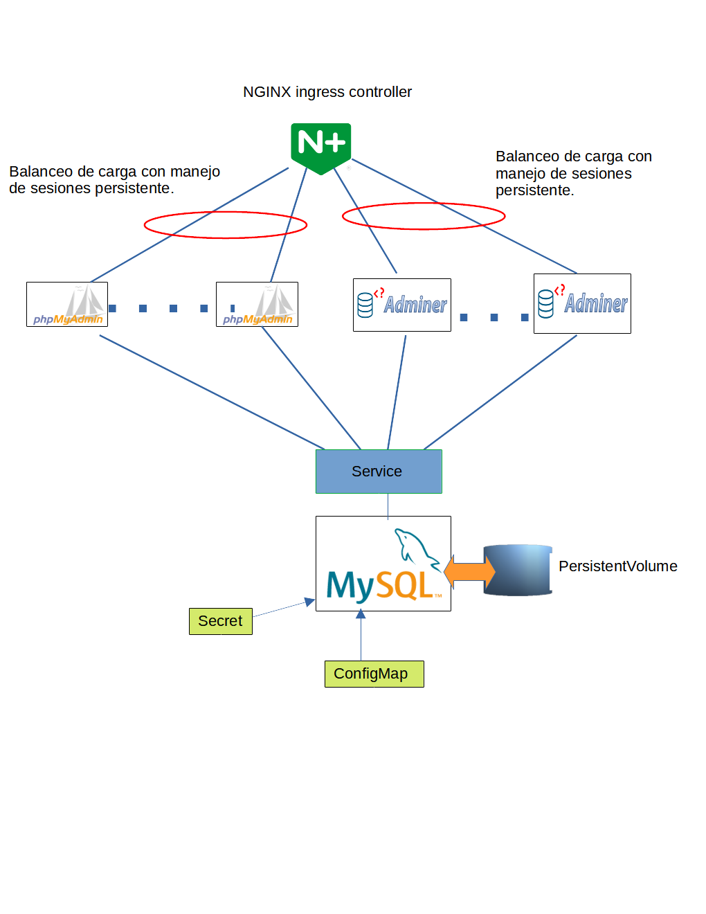
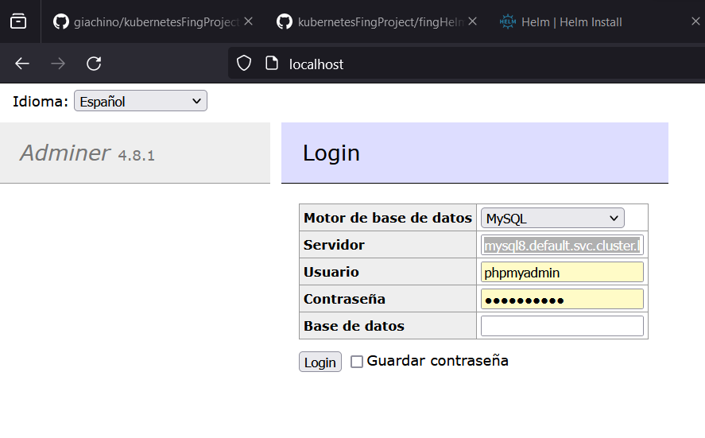
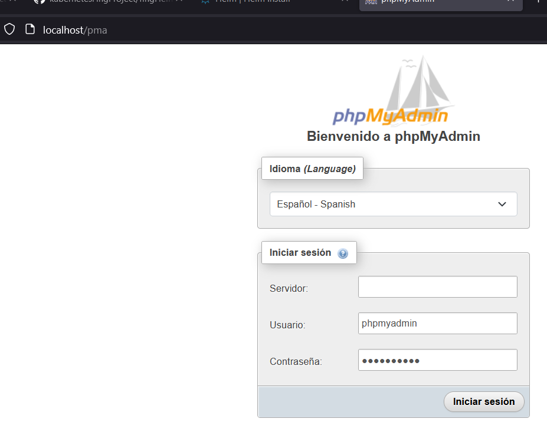

# kubernetesFingProject

***Proyecto de fin de curso kubernetes - Facultad de Ingeniería - UdelarR***

***Este proyecto genera un chart helm, el cual hace un despliege automático de una aplicación en tres capas en kubernetes.***

> [!TIP]
> ***SE SUGUIERE LA LECTURA DE EL DOCUMENTO [Reporte Técnico](Reporte_Tecnico__Kubernetes.pdf) QUE DESCRIBE LA MOTIVACIÓN DE LA ARQUITECTURA, LOS RETOS ENFRENTADOS, LOS CONCEPTOS Y ESTRUCTURAS UTILIZADOS Y LA ARGUMENTACIÓN DE LA ELECCIÓN DE TODOS LOS COMPONENTES Y CONFIGURACIONES.***

## Vista de alto nivel del deploy

## Acceso a la aplicación frontend Adminer

En este caso solo resta poner la password que se puede configurar en el chart (ver "Configuración de parametros").

## Acceso a la aplicación frontend phpmyadmin

En este caso solo resta poner la password que se puede configurar en el chart (ver "Configuración de parametros"). En el servidor se debe escribir a mano "mysql8.default.svc.cluster.local" ya que la imagen de docker utilizada no se le puede configurar como si se podía en la de adminer.

## Instalación

Para la instalación del mismo existen varias formas, las cuales se ven a continuación.

### Desde un repositorio de charts

> [!IMPORTANT]
> ***Se ha detectado en Windows que cuando se agrega el repositorio (helm repo add) no da error, pero luego al hacer helm install falla con un error que dice que el archivo descargado no tiene el formato correcto para un package. En ese caso puede intentar con las otras opciones de instalación. Cabe destacar que el package está bien formado, de manera que la URL es correcta, pero el error utilizando la instalación via un repo lo hemos visto.***

Primero agregar el repositorio a los repositorios locales:

`helm repo add pruebaRepo https://github.com/giachino/kubernetesFingProject/raw/create_repo/fingHelmPackage`

Luego de agregar el repo con nombre _"pruebaRepo"_ podemos instalar el chart en el paquete _"fingHelmChart"_
y hacer que localmente ese deploy tenga nombre _"pruebalocal"_:

`helm install pruebalocal pruebaRepo/fingHelmChart`

### Desde un archivo de chart local

Teniendo el package de forma local 

`helm install pruebalocal fingHelmChart-1.0.0.tgz`

### Desde un directorio de chart descomprimido

Si hacemos refencia al directorio raíz local del chart, podemos instalarlo así:

`helm install pruebalocal path/to/fingHelmChart`

### Desde una URL completa

Con la URL absoluta al archivo de package:

`helm install pruebalocal https://github.com/giachino/kubernetesFingProject/raw/create_repo/fingHelmPackage/fingHelmChart-1.0.0.tgz`

## Desintalación

Para desinstalar el chart que instalamos de nombre _"miDeploy"_:

`helm repo remove pruebalocal`

## Configuración de parametros

Los parámetros que se pueden configurar son los que siguen, y están separados por cada tipo de aplicación
que tiene cada POD (_mysql8_, _adminer_ y _phpmyadmin_).

> [!TIP]
> Todas las variables definidas tienen un valor por defecto, que se define dentro del archivo [values.yaml](fingHelmChart/values.yaml).
>
|**Aplicación**|**Componente**|**Variable**|**Valor**|**Descripción**|
|----------|----------|--------|-----|-----------|
|_mysql8:_||||Variables para la base de datos.|
|  |_configMap:_|||Parámetros específicos del ConfigMap|
|  |  |_database:_| _phpmyadmin_| Nombre de la base de datos a crear si no lo está previamente. En caso de no estar, se toma  _phpmyadmin_ por defecto.|
|  |  |_user:_| _phpmyadmin_| Nombre de usuario a crear en la base anterior si no lo está previamente.  En caso de no estar definido un valor, se toma  _phpmyadmin_ por defecto. A este usuario se le dan permisos máximos sobre la base especificada en el parámetro anterior.|
|  |_secret:_|||Parámetros específicos del Secret|
|  |  |_root_pw:_| _root.password_|password para el usuario root que se le configura al iniciar la base, si no lo está anteriormente. En caso de no estar, se toma  _root.password_ por defecto.|
|  |  |_user_pw:_| _phpmyadmin_|password para el usuario que se creó en la sección anterior del ConfigMap. En caso de no estar, se toma  _phpmyadmin_ por defecto.|
|  |_pv:_|||Parámetros específicos del PersistentVolume y del PersistentVolumeClaim.|
|  |  |_capacity:_| _1Gi_|Capacidad del PV y también del PVC, ya que el deploy hace que el PVC solicite el mismo tamaño del PV.|
|  |  |_accessMode:_| _ReadWriteOnce_|Seleccionar el modo de escritura.|
|  |  |_path:_| _/tmp/mysql_pre2_|En este caso el deploy utiliza storage local, y por eso se selecciona un directorio local para hacer de persistencia.|
|_phpmyadmin:_||||Variables para los PODs de phpmyadmin|
|  |_deploy:_|||Parámetros específicos del Deploy|
|  |  |_replicas:_| _4_|Cuantas réplicas levantamos en el deploy|
|  |  |_port:_||Puerto en que se expone la aplicación. Por defecto 8080.|
|  |  |_servicePort:_||Puerto en que se expone el servicio. Por defecto 8888.|
|_adminer:_||||Variables para los PODs de adminer|
|  |_deploy:_|||Parámetros específicos del Deploy|
|  |  |_replicas:_| _4_|Cuantas réplicas levantamos en el deploy|
|  |  |_port:_||Puerto en que se expone el aplicación. Por defecto 80.|
|  |  |_servicePort:_||Puerto en que se expone el servicio. Por defecto 8888.|
