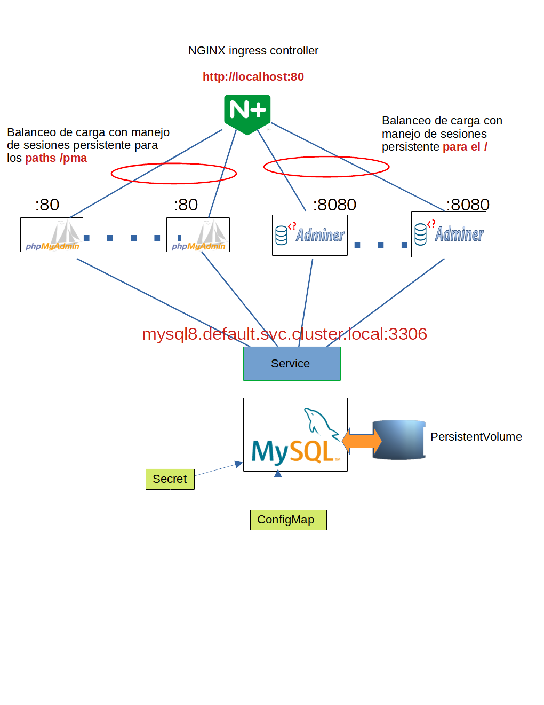

 

# kubernetesFingProject

Proyecto de fin de curso kubernetes - Facultad de Ingeniería - UdelarR

Este proyecto genera un chart helm, el cual hace un despliege automático 
de una aplicación en tres capas en kubernetes.

## Vista de alto nivel del deploy

## Acceso a la aplicación frontend Adminer

En este caso solo resta poner la password que se puede configurar en el chart (ver "Configuración de parametros").

## Acceso a la aplicación frontend phpmyadmin

En este caso solo resta poner la password que se puede configurar en el chart (ver "Configuración de parametros"). En el servidor se debe escribir a mano "mysql8.default.svc.cluster.local" ya que la imagen de docker utilizada no se le puede configurar como si se podía en la de adminer.

## Instalación

Para la instalación del mismo existen varias formas, las cuales se ven a continuación.

### Desde un repositorio de charts

Primero agregar el repositorio a los repositorios locales:

`helm repo add pruebaRepo https://github.com/giachino/kubernetesFingProject/raw/create_repo/fingHelmPackage`

Luego de agregar el repo con nombre "pruebaRepo" podemos instalar el chart en el paquete "fingHelmChart"
y hacer que localmente ese deploy tenga nombre "pruebalocal":

`helm install pruebalocal pruebaRepo/fingHelmChart`

### Desde un archivo de chart local

Teniendo el package de forma local 

`helm install pruebalocal fingHelmChart-1.0.0.tgz`

### Desde un directorio de chart descomprimido

Si hacemos refencia al directorio raíz local del chart, podemos instalarlo así:

`helm install pruebalocal path/to/fingHelmChart`

### Desde una URL completa

Con la URL absoluta al archivo de package:

`helm install pruebalocal https://github.com/giachino/kubernetesFingProject/raw/create_repo/fingHelmPackage/fingHelmChart-1.0.0.tgz`

## Desintalación

Para desinstalar el chart que instalamos de nombre "miDeploy":

`helm repo remove pruebalocal`

## Configuración de parametros

Los parámetros que se pueden configurar son los que siguen, y están separados por cada tipo de aplicación
que tiene cada POD (mysql8, adminer y phpmyadmin).

|aplicación|componente|variable|valor|descripción|
|----------|----------|--------|-----|-----------|
|mysql8:||||Variables para la base de datos.|
|  |configMap:|||Parámetros específicos del ConfigMap|
|  |  |database:| phpmyadmin| Nombre de la base de datos a crear si no lo está previamente.|
|  |  |user:| phpmyadmin| Nombre de usuario a crear en la base anterior si no lo está previamente. A este usuario se le dan permisos máximos sobre la base especificada en el parámetro anterior.|
|  |secret:|||Parámetros específicos del Secret|
|  |  |root_pw:| root.password|password para el usuario root que se le configura al iniciar la base, si no lo está anteriormente.|
|  |  |user_pw:| phpmyadmin|password para el usuario que se creó en la sección anterior del ConfigMap.|
|  |pv:|||Parámetros específicos del PersistentVolume y del PersistentVolumeClaim.|
|  |  |capacity:| 1Gi|Capacidad del PV y también del PVC, ya que el deploy hace que el PVC solicite el mismo tamaño del PV.|
|  |  |accessMode:| ReadWriteOnce|Seleccionar el modo de escritura.|
|  |  |path:| /tmp/mysql_pre2|En este caso el deploy utiliza storage local, y por eso se selecciona un directorio local para hacer de persistencia.|
|phpmyadmin:||||Variables para los PODs de phpmyadmin|
|  |deploy:|||Parámetros específicos del Deploy|
|  |  |replicas:| 4|Cuantas réplicas levantamos en el deploy|
|  |  |port:||Puerto en que se expone la aplicación. Por defecto 8080.|
|  |  |servicePort:||Puerto en que se expone el servicio. Por defecto 8888.|
|adminer:||||Variables para los PODs de adminer|
|  |deploy:|||Parámetros específicos del Deploy|
|  |  |replicas:| 4|Cuantas réplicas levantamos en el deploy|
|  |  |port:||Puerto en que se expone el aplicación. Por defecto 80.|
|  |  |servicePort:||Puerto en que se expone el servicio. Por defecto 8888.|